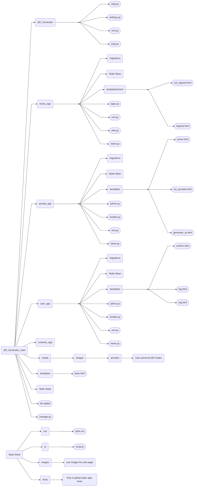

# Сайт генерації QR кодів / QR code generation site
#### Цей проект дозволяє користувачам цього сайту створювати QR коди з можливвстю кастомизації та онлайн сховища QR кодів! / This project allows users of this site to create QR codes with the possibility of customization and online storage of QR codes!
#### А для вас, як для хосту сайту, буде можливість місячного заробітку викоритовуючи підписки для користувачів на сайті! / And for you, as the site host, there will be an opportunity to earn monthly income using subscriptions for users on the site!

<!-- Вставь сюда демо версию потом -->

---

## Склад команди:
0. [Терешонок Максим]() - Тімлід команди / Team leader
1. [Агеєв Данило]() - Активний писач коду, активно працював з дизайном веб додатку / Active code writer, actively worked with web application design
2. [Олефіренко Глеб]() - Писач коду / Code writer

---

## Використані технології / Technologies used:
### Python
#### Це, мова програмування на якій працює практично все на бекенду / This is the programming language that runs almost everything on the backend.
_Нижче, будуть приведені фреймворки які були використані для створення бекенду / Below, the frameworks that were used to create the backend will be listed._
1. Django - Фреймворк, який, в нашому проекті, використовувався для роботи з цілим проектом на стороні серверу (бекенду) та для більш зручної праці з базами даних. Також, його шаблонізатор відповідає за динамічний контент веб-сторінок. / Django - A framework that, in our project, was used to work with the entire project on the server side (backend) and for more convenient work with databases. Also, its templating engine is responsible for dynamic content of web pages.
### HTML 5
#### Мова-конструктор, на якому побудована структура всіх веб-сторінок проекту. Його робота підкріплювалася зі сторони бекенду за допомогою шаблонізатору Django. / A construction language that built the structure of all the project's web pages. Its work was supported on the backend side using the Django templating engine.
### CSS
#### Мова для надання сторінкам стилів і деякого косметичного функціоналу / A language for giving pages styles and some cosmetic functionality
### JavaScript (JS)
#### Мова для створення інтерактивності веб-сторінок, відповідає за відправку даних без оновлення сторінки (XML запити) / Language for creating interactivity on web pages, responsible for sending data without refreshing the page (XML queries)

---

<details>
    <summary>Натисніть, щоб побачити інструкцію по запуску та обслуговуванню проекту / Click to see instructions for launching and maintaining the project</summary>
    УВАГА: Проект призначений для роботи на Операційній Системі Windows, тому для користувачів на других Операційних Системах можуть бути проблеми з налаштуванням шляхів / WARNING: The project is designed to work on the Windows Operating System, so users on other Operating Systems may have problems setting up paths_ 
    Рекомендується виконати всі інструкції, якщо ви хочете мати працюючий проект / It is recommended to follow all instructions if you want to have a working project.
    <details>
        <summary>Натисніть, щоб побачити інструкцію по запуску проекту / Click to see instructions for starting the project</summary>
        1. >Переконайтесь, що ви маєте версію Python >3.11 з встановленим PIP (Package Installer for Python) / Make sure you have Python version >3.11 with PIP (Package Installer for Python) installed
        2. >Встановіть цей проект собі на комп'ютер. Для цього, наведіться на зелену кнопку "<> Code" та натисність на найнижчу відкриту кнопку "Download ZIP" / Install this project on your computer. To do this, hover over the green "<> Code" button and click on the lowest open button "Download ZIP"
        3. >Розархівуйте встановлену ZIP папку / Unzip the installed ZIP folder
        4. >Відкрийте командний рядок у себе на комп'ютері та перейдіть у папку с проектом. Для цього відкрийте командний рядок у цій самий папці, або перейдіть у неї користуючись командою cd / Open a command prompt on your computer and navigate to the project folder. To do this, open a command prompt in the same folder, or navigate to it using the cd command.
        5. >Коли ви перейшли у QR_Code_Generator, напишіть цю команду / When you are in QR_Code_Generator, write this command:
        ```bash
            pip install -f requirements.txt
            # Це встановить всі залежності у проекта (всі бібліотеки, які потрібні для нормальної роботи програми) / This will install all dependencies for the project (all libraries that are required for the program to work properly)
        ```
        6. >Перейдіть у папку QR_Generator так, щоб вам був доступний файл manage.py (все ще за допомогою команди "cd") / Go to the QR_Generator folder so that you have access to the manage.py file (still using the "cd" command)
        7. >Створіть базу даних проекту / Create a project database:
        ```bash
            python manage.py migrate
            # Це проведе міграції бази даних - створить всі моделі проекту та зробе його базу даних працюючою / This will perform database migrations - create all project models and make its database working
        ```
        i. >Якщо ви маєте помилку (багато незрозумілого тексту) після використання цієї команди, використайте її ще раз, після виконання наступної команди / If you get an error (a lot of garbled text) after using this command, use it again, after running the following command:
        ```bash
            python manage.py makemigrations
            # Це створить міграції для бази даних. / This will create migrations for the database.
        ```
        8. >Запустість проект / Run project:
        ```bash
            python manage.py runserver
            # Це запустить проект локально / This will run project locally
        ```
        i. Якщо виникають помилки, переконайтеся, що ви не пропустили минулих пунктів / If errors occur, make sure you haven't missed any previous points.
        #### Для продовження налаштування проекту, відкрийте інструкцію по обслуговуванню проекта / To continue configuring the project, open the project maintenance manual.
    </details>
    <details>
        <summary>Натисніть, щоб побачити інструкцію по обслуговуванню проекту / Click to see the project maintenance instructions</summary>
        1. >Переконайтеся, що ви маєте створений проект по інструкції з запуску проекту / Make sure you have a project created according to the project launch instructions
        2. >Для створення першого адміністратора сторінки, переконайтеся що ви у папці с manage.py та використайте цю команду / To create the first page administrator, make sure you are in the folder with manage.py and use this command:
        ```bash
            python manage.py createsuperuser  
            # Після запуску цієї команди, вам будуть поставлені декілька запитань, а саме: юзер нейм, електронна пошта та пароль від вашого акаунту адмінстратора / After running this command, you will be asked several questions, namely: username, email, and password for your administrator account.
            # Важливо: Коли ви будете вводити пароль, він не буде виводитиь у консоль, тому це важливо його запам'ятати або скопіювати / Important: When you enter your password, it will not be displayed in the console, so it is important to remember or copy it.
        ```
        3. >Запустіть проект (сервер) по пункту 8 з інструкції запуску проекту / Start the project (server) according to step 8 of the project launch instructions.
        4. >Відкрийте посилання котре виведе в консоль (зазвичай це "http://127.0.0.1:8000/") / Open the link that will output to the console (usually "http://127.0.0.1:8000/")
        5. >У кінець адресного рядка введіть "admin" (зазвичай вийде "http://127.0.0.1:8000/admin/") / At the end of the address bar, type "admin" (usually it will be "http://127.0.0.1:8000/admin/")
        6. >Введіть ваш юзернейм та пароль у відповідні поля / Enter your username and password in the appropriate fields.
        7. >Створіть першу підписку / Create your first subscription:
            1. Відкрийте Subscriptions  у відкрившомуся сторінці адміністратора / Open Subscriptions in the opened admin page
            2. Натисніть "ADD SUBSCRIPTION" / Click "ADD SUBSCRIPTION"
            3. У якості імені (Title) обов'язково введіть "Free" (тільки для першої підписки - вона необхідна для роботи всієї системи підписок) / Be sure to enter "Free" as the Title (only for the first subscription - it is necessary for the entire subscription system to work)
            4. Введіть відповідні значення у поля Description (коротко), Price, Max qrcodes / Enter the appropriate values ​​in the Description (short), Price, Max qrcodes fields
            5. Якщо ви хочете створити підписку, котра буде доступна тільки адміністраторам, ввимкніть Visible (натисніть по галочці) / If you want to create a subscription that will only be available to administrators, turn off Visible (click the check mark)
        7. >Для того, щоб ваш акаунт адміністратора міг користуватися сайтом, виконайте наступну послідовність дій / To enable your administrator account to use the site, follow these steps::
            1. Відкрийте Accounts на сторінці адміністратора / Open Accounts on the admin page
            2. Натисніть "ADD ACCOUNT" / Click "ADD ACCOUNT"
            3. У якості User виберіть свій поточний акаунт / As User, select your current account
            4. У поле Verified введіть 1 / In Verified field enter 1
            5. У Subscription виберіть нещодавно створену підписку / Under Subscription, select the newly created subscription
        8. >Якщо ви хочете видалити об'єкти будь якої моделі, виконайте наступну послідовність подій / If you want to delete objects from any model, follow the following sequence of events:
            1. Відкрийте модель за допомогою натискання на неї на сторінці адміністратора / Open the model by clicking on it on the admin page
            2. Виберіть об'єкти за допомогою натискання на квадратик зліва від назви об'єкта / Select objects by clicking on the box to the left of the object name.
            3. У полі вибору біля тексту Action виберіть "Delete selected {назва моделі}s" та натисність "Go" / In the selection box next to the Action text, select "Delete selected {model name}s" and click "Go"
        i. Рекомендовано створювати QR коди тільки на сторінці створення QR кода, намагайтеся не користуватися сторінкою адміністрації для цього / It is recommended to create QR codes only on the QR code creation page, try not to use the administration page for this
    </details>
</details>

<details>
<summary>Натисніть, щоб побачити схематичну структуру проекту / Click to see the schematic structure of the project</summary>

#### Нижче приведена структура проекту / Below is the project structure


*app - Папка у якій створен веб додаток і його базові складові (інші є у папці static та templates) / The folder in which the web application and its basic components are created (others are in the static and templates folder)

    admin.py - Відповідає за реєстрацію моделі для адмін сторінки (а також за її оформлення) / Responsible for registering the model for the page admin (as well as for its design)

    apps.py - Відповідає за головну інформацію додатку для роботи Django фреймворка / Responsible for the main information of the application for the Django framework to work

    models.py - Відповідає за моделі (таблиці) у базі даних / Responsible for models (tables) in the database

    tests.py - Відповідає за проведення серій тестів за допомогою Django інструментів (не використовується) / Responsible for running a series of tests using Django tools (not used)

    urls.py - Відповідає за встановлення посилання до сторінок, а також функцій, котрі їх оброблюють / Responsible for establishing links to pages, as well as the functions that process them

    templates - Папка у якій зберігаються усі веб сторінки даного додатку / Folder in which all web pages of this application are stored

        *.html - Відповідає за конструкцію веб сторінки / Responsible for the design of the web page


project - Папка, у якій створено всі складові фундаменту проекту / Folder in which all components of the foundation of the project are created

    asgi.py - Відповідає за асинхронну, складнішу, але більш швидку роботу Django (фреймворку, який відповідає за цілий бекенд) / Responsible for the asynchronous, more complex, but faster work of Django (the framework responsible for the entire backend)

    settings.py - Відповідає за налаштування роботи бекенду / Responsible for configuring the backend

    urls.py - Відповідає за налаштування веб адресів сторінок та media файлів / Responsible for setting web addresses of pages and media files

    wsgi.py - Відповідає за синхрону, простішу, але повільнішу роботу Django (фреймворк, який відповідає за цілий бекенд) / Responsible for the synchronous, simpler, but slower operation of Django (the framework responsible for the entire backend)


static - Папка у якій зберігаються усі статичні файли (js/css/картинки) / Folder in which all static files (js/css/images) are stored


    *_app - Папка яка відповідає за статичні файли вказаного додатка / The folder responsible for the static files of the specified application

        js - Папка, у якій зберігаються усі js скрипти / The folder where all js scripts are stored

            script.js - Файл з скриптом додатку / Application script file

        css - Папка, у якій зберігаються усі css стилі / The folder where all css styles are stored

            styles.css - Файл з стилями додатку / Application styles file

        images - Папка, у якій зберігаються усі зображення / The folder where all images are stored

        fonts - Папка, у якій зберігаються усі шрифти / The folder where all fonts are stored
            
            *.ttf - Файл з інформацією про шрифт / Font information file


manage.py - Файл, який користується для роботи вас з цим проектом / The file that you use to work with this project

README.md - Файл, котрий ви зараз читаєте. Створенний для пояснювання проекту для оточуючих. / The file you are currently reading. Created to explain the project to others. 
</details>

---

#### Посилання на проект у Figma, де створювався дизайн проекту / Link to the project in Figma where the project design was created: https://www.figma.com/design/QNoAIRnomVT5osDP8dU3UM/Home-Practice?node-id=134-177&t=FuI9B4tIHoOlSSk8-1
### Цей проект був корисним для мене і моєї команди для розвитку у праці з Django фреймворком та створення хоч і простого, але працюючого дизайну за допомогою Figma. / This project was useful for me and my team to develop their skills in working with the Django framework and creating a simple but working design using Figma.